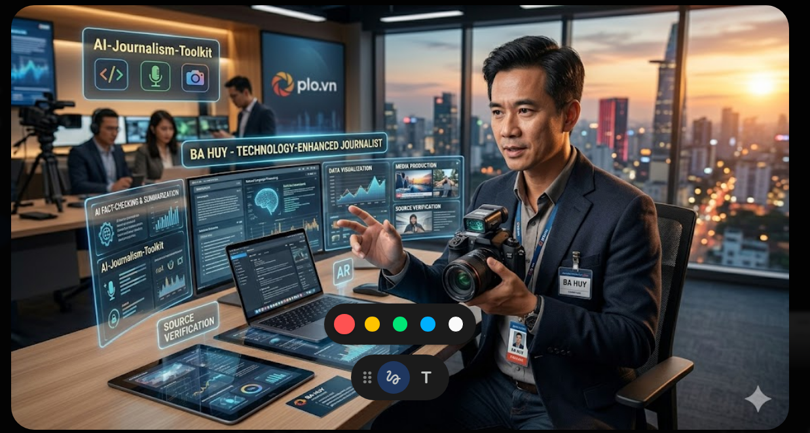

# 🎨 Triển lãm Infographic & AI - Nhà báo BA HUY

Chào mừng bạn đến với không gian sáng tạo của tôi - nơi hội ngộ giữa Nghiệp vụ Báo chí và Trí tuệ nhân tạo.

---

## 🤖 Chân dung Nhà báo Công nghệ

---

## 📊 Các tác phẩm Infographic tiêu biểu

## 📸 Nhật ký Tác nghiệp Công nghệ 4.0

Dưới đây là các khía cạnh trong công việc hàng ngày của tôi khi ứng dụng AI:

### 1. ✍️ Biên tập & Phân tích tin bài với AI

*Ứng dụng LLMs để tóm tắt, kiểm chứng thông tin và tối ưu hóa nội dung.*

### 2. 🎤 Tác nghiệp hiện trường hiện đại

*Sử dụng các thiết bị hỗ trợ AI để tác nghiệp nhanh chóng, chính xác ngay tại hiện trường.*

### 3. 💻 Nâng cấp nghiệp vụ & Phát triển công cụ

*Tự phát triển các công cụ hỗ trợ (AI-Journalism-Toolkit) để tối ưu hóa quy trình làm báo.*

---
